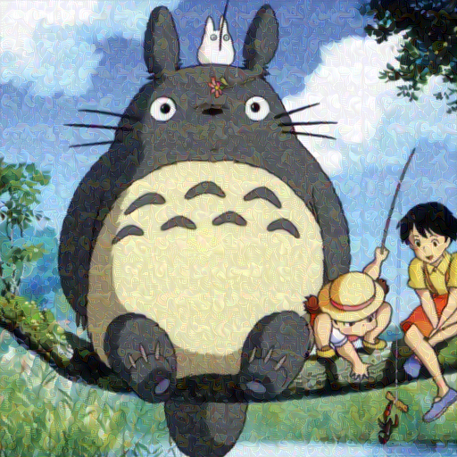

# PDM-Pure: Effective Purification in One Simple Python Script


> PDM-Pure is from our paper: Pixel is a Barrier: Rethinking Adversarial-Based Protection for Diffusion-Based Generation [coming soon]


## Introduction

It is a **simple** but **effective** purification framework to purify protective perturbations, all you need to do is to run the single file:

```
python pdm_pure.py --image [IMAGE_PATH] --save_path [SAVE_PATH] 
```

e.g. `python pdm_pure.py --image demo/advdm/original.png --save_path demo/advdm/`


## Installation ⚙️

For installaiton please refer to [DeepFloyd IF](https://github.com/deep-floyd/IF/tree/develop), which is the strongest opensource pixel space diffusion model (PDM) we used to purify the images.

## Results 🔍

#### Protected by AdvDM [1]


#### Protected by Mist [2]



#### Protected by Glaze [3]


#### Protected by SDS [4]


## Reference
[1] Liang, Chumeng, et al. "Adversarial Example Does Good: Preventing Painting Imitation from Diffusion Models via Adversarial Examples." International Conference on Machine Learning. PMLR, 2023.

[2] Liang, Chumeng, and Xiaoyu Wu. "Mist: Towards improved adversarial examples for diffusion models." arXiv preprint arXiv:2305.12683 (2023).


[3] Shan, Shawn, et al. "Glaze: Protecting Artists from Style Mimicry by {Text-to-Image} Models." 32nd USENIX Security Symposium (USENIX Security 23). 2023.

[4] Xue, Haotian, et al. "Toward effective protection against diffusion-based mimicry through score distillation." The Twelfth International Conference on Learning Representations. 2023.
